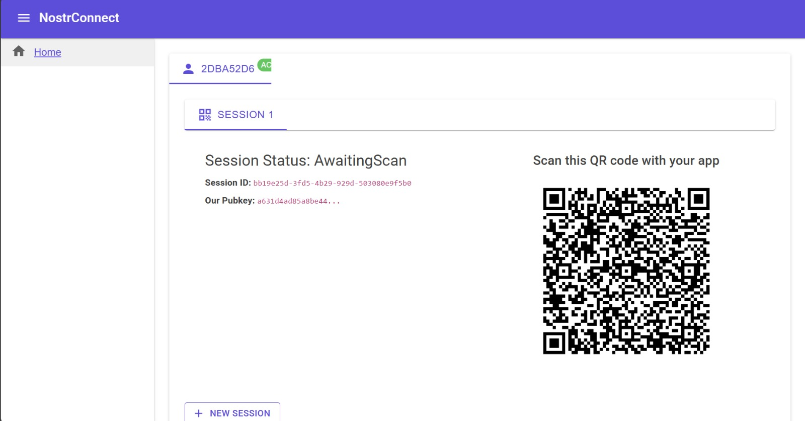
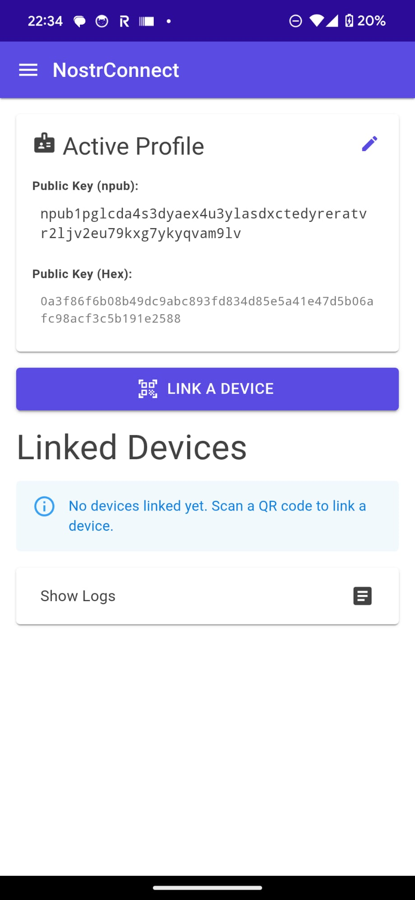
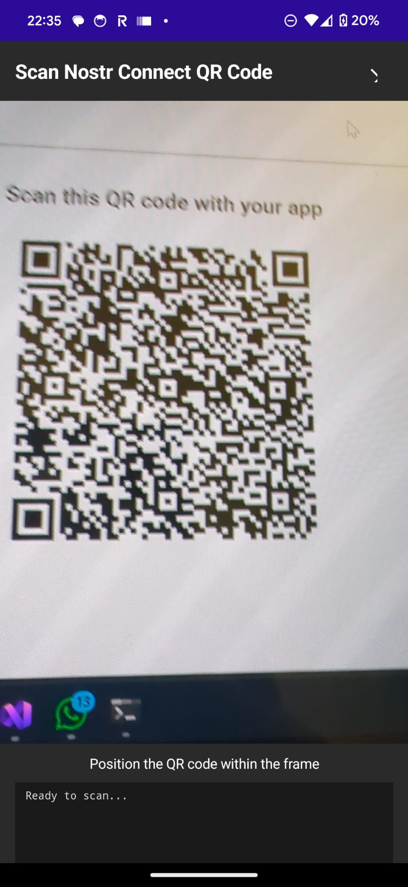
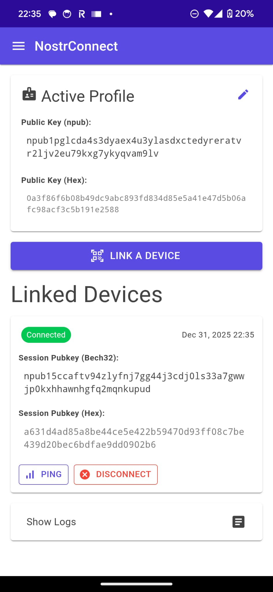
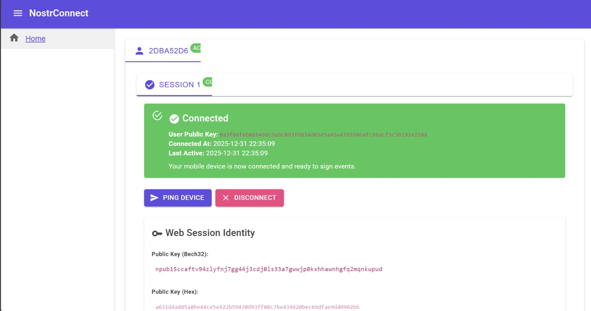

# BlazeJump.NostrConnect

Use an Android device as your cryptographic identity for web applications.

A cross-platform Nostr Connect implementation that enables secure communication between a web browser client and an Android mobile device for cryptographic signing operations.

<div align="center">

### Browser QR Code Generation


### Mobile App - Link Device


### Scanning QR Code


### Connected Sessions
<table>
<tr>
<td></td>
<td></td>
</tr>
<tr>
<td align="center"><i>Mobile: Connected Device</i></td>
<td align="center"><i>Browser: Active Session</i></td>
</tr>
</table>

</div>

---

## Overview

NostrConnect allows you to use your Android device as a secure signing device for Nostr events. The web application generates QR codes that can be scanned by the mobile app to establish an encrypted connection over Nostr relays.

## Architecture

- **NostrConnect.Web** - Blazor WebAssembly application that runs in the browser
- **NostrConnect.Maui** - .NET MAUI Android application for mobile signing
- **BlazeJump.Tools** - Shared library containing core Nostr Connect functionality
- **BlazeJump.Tools.Tests** - Unit and integration tests

## Prerequisites

- [.NET 9 SDK](https://dotnet.microsoft.com/download/dotnet/9.0)
- Visual Studio 2022 (17.8 or later) with:
  - ASP.NET and web development workload
  - .NET Multi-platform App UI development workload
- Android device or emulator (Android 7.0 / API 24 or higher)

## Getting Started

### Running the Web Application

1. Clone the repository:
   ```bash
   git clone https://github.com/drmikesamy/BlazeJump.NostrConnect.git
   cd BlazeJump.NostrConnect
   ```

2. Navigate to the web project:
   ```bash
   cd NostrConnect.Web
   ```

3. Run the application:
   ```bash
   dotnet run
   ```

4. Open your browser to `https://localhost:5001` (or the URL shown in the console)

### Running the Android Application

#### Using Visual Studio

1. Open `NostrConnect.sln` in Visual Studio 2022
2. Set `NostrConnect.Maui` as the startup project
3. Select an Android device or emulator from the device dropdown
4. Press F5 or click the Run button

#### Using Command Line

1. Navigate to the MAUI project:
   ```bash
   cd NostrConnect.Maui
   ```

2. Build and run on Android:
   ```bash
   dotnet build -t:Run -f net9.0-android
   ```

## Deploying to Android

### Debug Build

1. Connect your Android device via USB with USB debugging enabled
2. In Visual Studio, select your device from the dropdown
3. Click Run to deploy and launch the app

### Release Build

1. Generate a signing key (if you don't have one):
   ```bash
   keytool -genkey -v -keystore myapp.keystore -alias myapp -keyalg RSA -keysize 2048 -validity 10000
   ```

2. Build the release APK:
   ```bash
   dotnet publish -f net9.0-android -c Release
   ```

3. The APK will be in `NostrConnect.Maui/bin/Release/net9.0-android/publish/`

4. Install on device:
   ```bash
   adb install path/to/your-app.apk
   ```

### Publishing to Google Play Store

1. Create a signed release build with the steps above
2. Follow [Google Play Console documentation](https://support.google.com/googleplay/android-developer/answer/9859152)
3. Upload your AAB/APK through the Google Play Console

## Connecting Android and Desktop

### Initial Setup

1. **On Android Device:**
   - Open the NostrConnect app
   - Tap "Create New Profile" or import an existing Nostr key
   - Grant camera permissions when prompted

2. **On Desktop Browser:**
   - Open the NostrConnect web application
   - A QR code will be displayed automatically

3. **Establish Connection:**
   - In the Android app, tap "Link a Device"
   - Scan the QR code displayed on the desktop
   - Connection will be established automatically

### Using the Connection

Once connected:
- The web application can send signing requests to your Android device
- Click "Ping Device" to test the connection
- All cryptographic operations are performed securely on your Android device
- The desktop never has access to your private keys

### Disconnecting

- **From Web:** Click the "Disconnect" button next to the connected session
- **From Android:** Tap the "Disconnect" button for the linked device

## Configuration

### Relay Settings

Default relay: `wss://relay.damus.io`

To add additional relays:
1. **Android:** Navigate to Settings ? Edit Relays
2. **Web:** Relays are configured in the code (configurable relays coming soon)

### Session Management

- Sessions persist between app restarts
- Multiple sessions can be active simultaneously
- Each session has its own ephemeral keypair for enhanced security

## Testing

Run the test suite:

```bash
dotnet test
```

Run specific test categories:

```bash
dotnet test --filter Category=Integration
```

## Project Structure

```
BlazeJump.NostrConnect/
??? NostrConnect.Web/           # Blazor WebAssembly web client
?   ??? Components/
?   ?   ??? Pages/
?   ??? Services/
??? NostrConnect.Maui/          # .NET MAUI Android app
?   ??? Components/
?   ?   ??? Pages/
?   ??? Pages/                  # Native MAUI pages
?   ??? Services/
??? BlazeJump.Tools/            # Shared library
?   ??? Builders/               # URI and message builders
?   ??? Enums/                  # Nostr enums (Kind, Command, etc.)
?   ??? Helpers/                # Utility helpers
?   ??? Models/                 # Data models
?   ??? Services/               # Core services
?       ??? Connections/        # WebSocket relay management
?       ??? Crypto/             # NIP-04/NIP-44 encryption
?       ??? Identity/           # Session management
?       ??? Logging/            # Logging service
?       ??? Message/            # Nostr message handling
??? BlazeJump.Tools.Tests/      # Test project
```

## Contributing

We welcome contributions! Here's how to get started:

### Getting Started

1. Fork the repository
2. Create a feature branch:
   ```bash
   git checkout -b feature/your-feature-name
   ```
3. Make your changes
4. Write or update tests as needed
5. Commit your changes:
   ```bash
   git commit -am 'Add some feature'
   ```
6. Push to the branch:
   ```bash
   git push origin feature/your-feature-name
   ```
7. Create a Pull Request

### Coding Standards

- Follow C# coding conventions
- Use meaningful variable and method names
- Add XML documentation comments for public APIs
- Keep methods focused and concise
- Write unit tests for new functionality

### Pull Request Guidelines

- Provide a clear description of the changes
- Reference any related issues
- Ensure all tests pass
- Update documentation as needed
- Keep PRs focused on a single concern

### Areas for Contribution

- ?? Bug fixes
- ? New NIP (Nostr Implementation Possibilities) support
- ?? iOS support (.NET MAUI iOS target)
- ?? UI/UX improvements
- ?? Documentation improvements
- ?? Additional test coverage
- ?? Security enhancements

### Reporting Issues

When reporting issues, please include:
- Clear description of the problem
- Steps to reproduce
- Expected vs actual behavior
- Environment details (OS, .NET version, device)
- Screenshots if applicable

## Security

This application handles cryptographic keys and sensitive data. Key security features:

- ? Private keys never leave the Android device
- ? NIP-44 encryption for all messages
- ? Ephemeral session keys
- ? Secure key storage on Android
- ? No cloud backup of private keys

If you discover a security vulnerability, please email [security contact] instead of using the issue tracker.

## License

This project is licensed under the MIT License - see the [LICENSE](LICENSE) file for details.

## Acknowledgments

- Built with [.NET MAUI](https://dotnet.microsoft.com/apps/maui)
- Uses [MudBlazor](https://mudblazor.com/) for UI components
- Implements [Nostr Protocol](https://github.com/nostr-protocol/nostr) (NIPs 01, 04, 44, 46)
- QR code generation via [QRCoder](https://github.com/codebude/QRCoder)

## Support

- ?? [Nostr Protocol Documentation](https://github.com/nostr-protocol/nostr)
- ?? [GitHub Issues](https://github.com/drmikesamy/BlazeJump.NostrConnect/issues)
- ?? [Report a Bug](https://github.com/drmikesamy/BlazeJump.NostrConnect/issues/new)

## Roadmap

- [ ] iOS support
- [ ] Multi-language support
- [ ] Enhanced relay management
- [ ] Configurable permissions per session
- [ ] Event signing approval UI
- [ ] Backup and restore functionality
- [ ] NIP-07 browser extension support


Built with ?? using .NET 9 and Nostr
